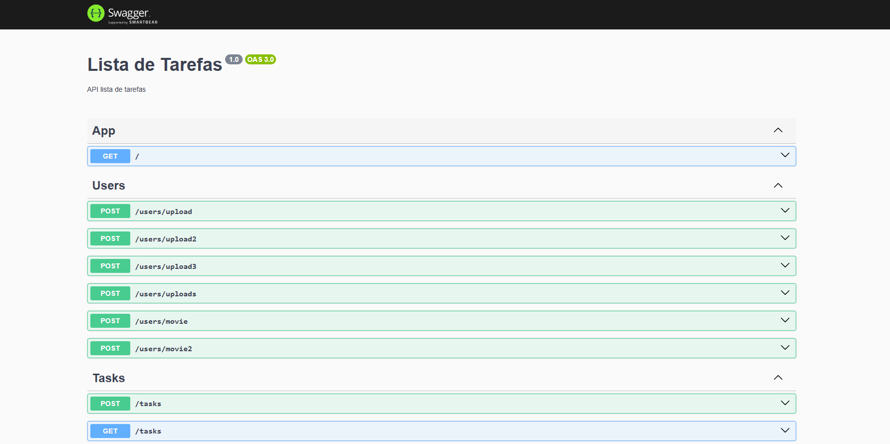

#### API Revisão 03

#### Docs


* Link ref
``` 4min
link: https://www.udemy.com/course/nestjs-completo/learn/lecture/47024389#questions
```

* Nest Config
``` https://www.udemy.com/course/nestjs-completo/learn/lecture/47024699#questions
npm i --save @nestjs/config
```

* Ref.
```
https://www.udemy.com/course/nestjs-completo/learn/lecture/47025763#questions
```
